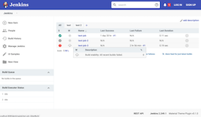
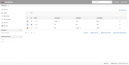
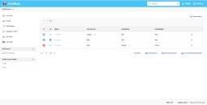

# A Material Theme plugin for Jenkins.

[](https://ci.jenkins.io/job/Plugins/job/material-theme-plugin/job/master/)
[](https://gitter.im/jenkinsci/ux-sig?utm_source=badge&utm_medium=badge&utm_campaign=pr-badge)
[](https://github.com/jenkinsci/material-theme-plugin/releases/)
[](https://plugins.jenkins.io/material-theme)
[](https://plugins.jenkins.io/material-theme)

## Description
This is an attempt to port the Afonso F's Jenkins material theme (http://afonsof.com/jenkins-material-theme/) to use Theme Manager plugin (https://github.com/jenkinsci/theme-manager-plugin#configuring-the-plugin).
This should allow Jenkins administrators to easily switch themes and allow users to select their own theme.

## Screenshots
'Red':

[](screenshots/red_main_large.png)

'Indigo':

[](screenshots/indigo_main_large.png)

'Grey':

[](screenshots/grey_main_large.png)

'Light Blue':

[](screenshots/light_blue_main_large.png)

## Installation
To install this theme search for 'Material theme' in your Jenkins update center.

## Configuration
Go to the "Configure System" page, search for 'Built-in Themes' and select 'Material - Indigo' or 'Material - Red'

Or with the [configuration-as-code](https://github.com/jenkinsci/configuration-as-code-plugin) plugin:

```yaml
unclassified:
  themeManager:
    disableUserThemes: true
    theme: "material-indigo" # or 'material-red' or 'material-grey' or 'material-light-blue' 
```

## Running (development)
To build and run this plugin you should only need to run:
```
mvn clean hpi:run
```

## Development tools
Here is a list of the tools (and versions) I have in my development enviornment - outside of those handeled in the pom.xml.
Java 11
Maven 3.5


## Releasing
To release a new version of this plugin, please follow these steps: 
https://www.jenkins.io/doc/developer/publishing/releasing/

## Disclaimer
I am not a front-end web or Java developer. The CCS in the project has mostly been copied from http://afonsof.com/jenkins-material-theme/. The Java in this project has modified from the dark theme plugin (https://github.com/jenkinsci/dark-theme-plugin). 

## Future work
- Add the ability for users to define custom theme pallets.
- Need to add tests to check:
  - That when a theme is loaded through the UI, that the correct theme is loaded.

## Thanks to
- [Jenkins Material Theme][jenkins-material-theme] for the original theme.
- [jenkins-contrib-theme][jenkins-contrib-theme] for the core theme
- [Google][google] for the the material design inspiration and the icons
- [Material Design Icons][material-design-icons] for some extra icons
- [Theme Manager][theme-manager-plugin] for the base plugin.
- [Dark Theme for Jenkins][dark-theme-plugin] for a good example of using the theme manager.

[jenkins-contrib-theme]: https://github.com/jenkins-contrib-themes/jenkins-core-theme
[google]: https://www.google.com/design/spec/material-design/introduction.html
[material-design-icons]: https://materialdesignicons.com/
[jenkins-material-theme]: https://github.com/afonsof/jenkins-material-theme
[theme-manager-plugin]: https://plugins.jenkins.io/theme-manager/
[dark-theme-plugin]: https://plugins.jenkins.io/dark-theme/
