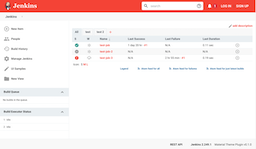

# jenkins-material-theme-plugin
## Summary
A Material Theme plugin for Jenkins.

## Description
This is an attempt to port the Afonso F's Jenkins material theme (http://afonsof.com/jenkins-material-theme/) to use Theme Manager plugin (https://github.com/jenkinsci/theme-manager-plugin#configuring-the-plugin).
This should allow Jenkins administrators to easily switch themes and allow users to select their own theme.

## Screenshots
'Red':

[](images/red_main_large.png)

'Indigo':

[](images/indigo_main_large.png)

## Running (development)
To build and run this plugin you should only need to run:
```
mvn clean hpi:run
```

## Disclaimer
I am not a front-end web or Java developer. The CCS in the project has mostly been copied from http://afonsof.com/jenkins-material-theme/. The Java in this project has modified from the dark theme plugin (https://github.com/jenkinsci/dark-theme-plugin). 

## Future work
- Add the ability for users to define custom theme pallets.
- Need to add tests to check:
  - That when a theme is loaded through the UI, that the correct theme is loaded.

## Thanks to
- [Jenkins Material Theme][jenkins-material-theme] for the original theme.
- [jenkins-contrib-theme][jenkins-contrib-theme] for the core theme
- [Google][google] for the the material design inspiration and the icons
- [Material Design Icons][material-design-icons] for some extra icons
- [Theme Manager][theme-manager-plugin] for the base plugin.
- [Dark Theme for Jenkins][dark-theme-plugin] for a good example of using the theme manager.

[jenkins-contrib-theme]: https://github.com/jenkins-contrib-themes/jenkins-core-theme
[google]: https://www.google.com/design/spec/material-design/introduction.html
[material-design-icons]: https://materialdesignicons.com/
[jenkins-material-theme]: https://github.com/afonsof/jenkins-material-theme
[theme-manager-plugin]: https://plugins.jenkins.io/theme-manager/
[dark-theme-plugin]: https://plugins.jenkins.io/dark-theme/
